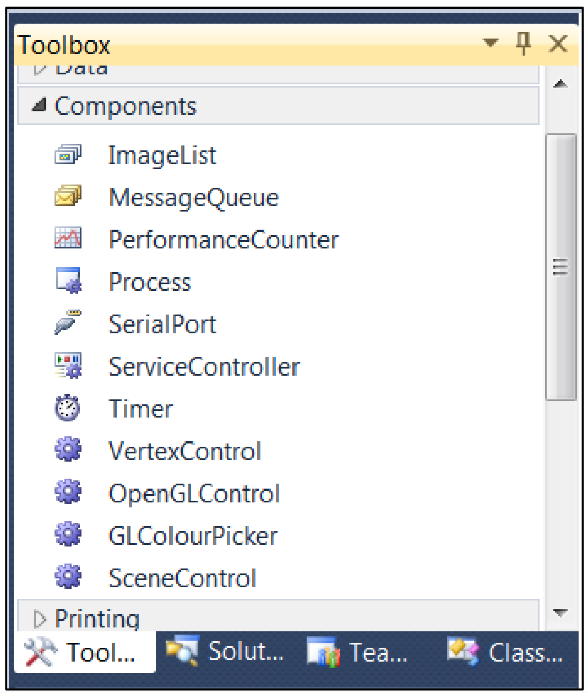
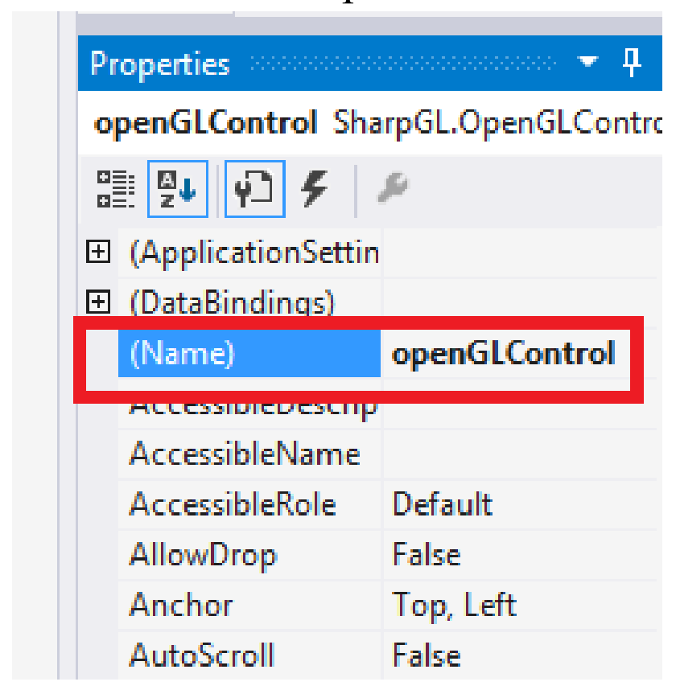

# Introduction
 This project users can draw some simple sharps (line, square, circle,….),  move/rotate sharps, resize and fill colors. This project I code by C# and use OpenGL/SharpGL.
 
# Installation and How to use
- Go to this page [Wikipedia](www.opengl.org/wiki/Getting_Started) to update the latest screen driver for 
each operating system. After the update is complete, you will get the latest version of 
OpenGL library.
- Go to folder <b>"SharpGL.WinForms"</b> to get SharpGL library (dll library files)
- How to use:
1. Create a new Project, select language C#
2. Select the project type Windows Forms Application or WPF Application. This project 
type is not available OpenGLControl so it must be added.

 2.1. Check the Toolbox bar, Component tab to see if there is OpenGLControl, if yes then 
go to step 2.4, if not, go to the next step.

    

  <b>Toolbox bar</b>

 2.2. Link to the library of SharpGL: in Solution Explorer window → right click on project 
choose Add, then choose Reference → choose Browse tab → find and add
SharpGL.dll, SharpGl.WinForms.dll (for Windows Forms) hoặc SharpGL.WPF.dll 
(for WFP), SharpGLSceneGraph.dll

 2.3. Add OpenGLControl into Toolbox: right click on Component tab in Toolbox →
Choose Item → Browse → find and choose file SharpGl.WinForms.dll (Windows 
Forms) or SharpGL.WPF.dll (WFP)

2.4. Drag OpenGLControl and put into form, then use it normally. Name OpenGLControl 
is openGLControl. Right click on OpenGLControl, choose Properties, rename in
Name field of Properties.

    

  <b>Name field of Properties</b>

